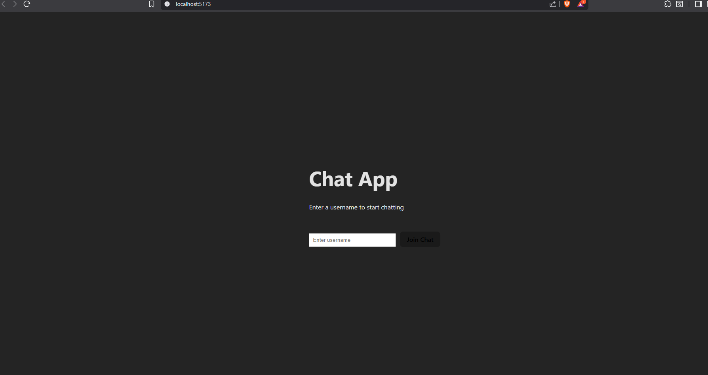
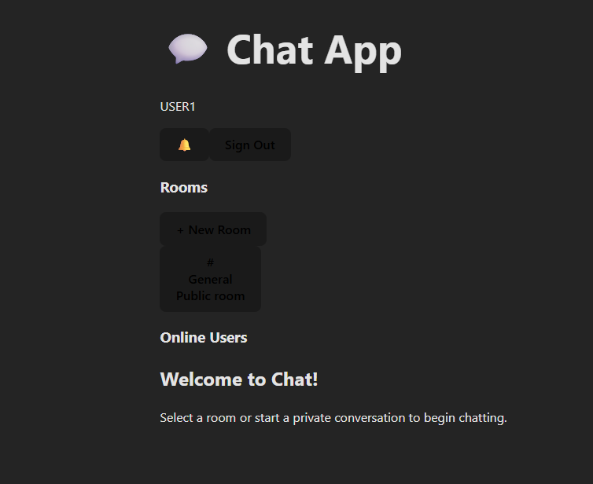
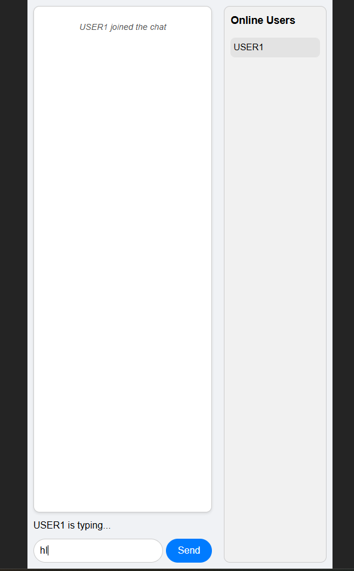
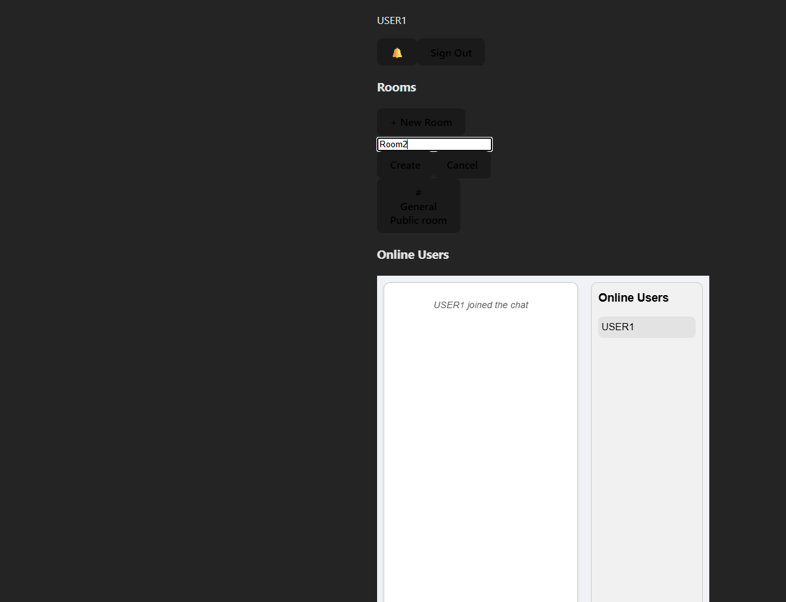
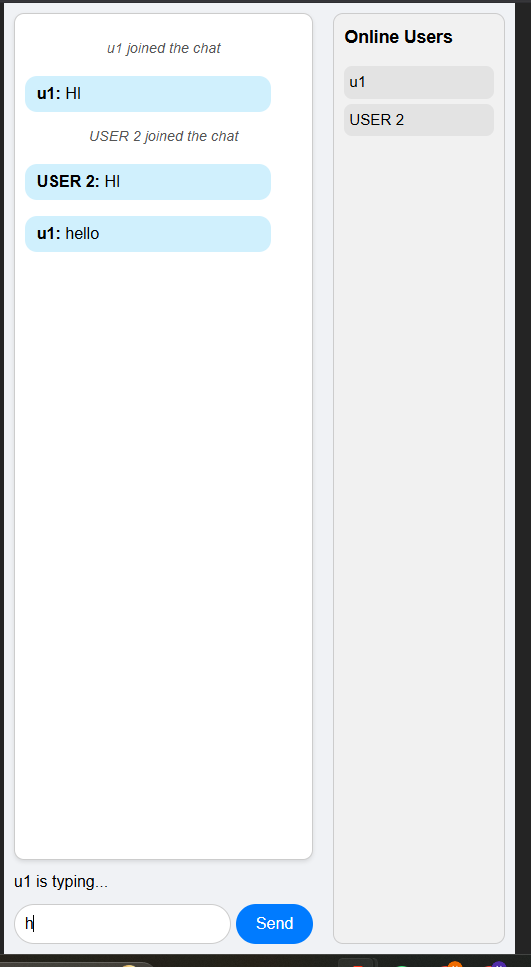

# 💬 Chat App

A modern chat application built with **React** and **Socket.IO** featuring:

- Real-time **chat rooms** (create/join)
- **Private messaging** between users
- **Notifications** with unread count
- User **sign-out** functionality

---
## Live Demo

- Frontend (Vercel): https://real-time-communication-with-socket-rose.vercel.app/

- Backend (Render): https://week5-chat-backend-61ui.onrender.com


## **Features**

1. **Room Management**
   - Create or join chat rooms
   - Switch between rooms easily

2. **Private Chat**
   - Chat directly with online users
   - See typing indicators in private chats

3. **Notifications**
   - Unread message counter
   - Toggle notifications panel

4. **User Management**
   - Sign in with a username
   - Sign out anytime

---

## **Screenshots**







---

## **Installation**
# Clone the repository
```bash
git clone https://github.com/PLP-MERN-Stack-Development/real-time-communication-with-socket-io-naomitesfe.git
cd chat-app 
```
# Install dependencies
```bash
npm install
```

# Start the app
```bash
npm start
```
Open http://localhost:5173
 in your browser.

## Usage
- Enter your username and log in.
- Select or create a chat room.
- Send messages in the room or privately to other users.
- Toggle notifications to view unread messages.
- Click Sign Out to end your session.


## Foder Structure
chat-app/
├── public/
├── src/
│   ├── components/     # React components (ChatRoom, PrivateChat, etc.)
│   ├── socket/         # Socket.IO logic
│   ├── App.jsx
│   └── index.jsx
├── package.json
├── .gitignore
└── README.md

# Contributing
- Fork the repo.
- Create a feature branch: git checkout -b feature/my-feature
- Commit changes: git commit -m "Add my feature"
- Push branch: git push origin feature/my-feature
- Open a Pull Request


